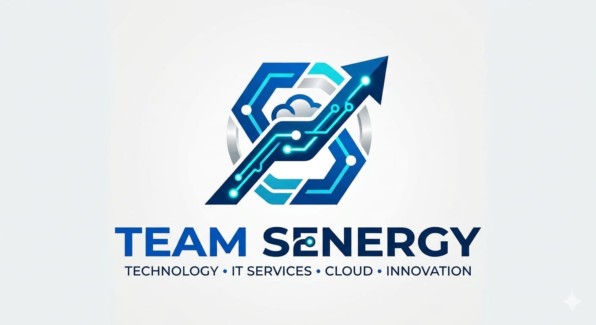

# 🚀 Team Senergy

### Premium Technology • Development • Security • Innovation

  

---

# 🌍 About Team Senergy

**Team Senergy** is a premium software development and technology solutions team founded by **Ayush Sharma** and **Abhishek**.

We build **modern, scalable, secure digital systems** for businesses, startups, institutions, and organizations.

Our work combines:

- 💻 Full Stack Engineering  
- 🔐 Cybersecurity Solutions  
- 🤖 Artificial Intelligence / Machine Learning  
- ☁️ Cloud Deployment  
- ⚙️ Automation Systems  

---

# 👨‍💻 Founders

## Ayush Sharma
- Frontend Development  
- Backend Development  
- Deployment Specialist  
- Database Architect  
- Full Stack Engineer  
- AI / ML Integration  
- AWS / Hostinger Deployment  

## Abhishek
- Full Stack Development  
- Cybersecurity Solutions  
- Python Engineering  
- Java Development  
- AI-Based Systems  

---

# 🧠 Core Expertise

| Domain | Expertise |
|-------|-----------|
| 💻 Development | Full Stack Web Applications, APIs, Dashboards |
| 🔐 Cybersecurity | Security Testing, Vulnerability Analysis |
| 🤖 AI / ML | Malware Detection, Intelligent Systems |
| ☁️ Cloud | Production Deployment, Hosting Setup |

---

# 🚀 Major Projects

## 🌐 lookindharamshala.com
Premium digital platform designed for business visibility and local digital presence.

✔ SEO Architecture  
✔ Responsive UI  
✔ Business Scalability  
✔ Modern Web Design  

---

## ♟️ kangraChessclub.com
Digital ecosystem for chess community growth and tournament visibility.

✔ Tournament Publishing  
✔ Event Management  
✔ Community Access  

---

## 🏥 Bhagwati Clinic
Healthcare digital platform.

✔ Clinic Service Interface  
✔ Contact Systems  
✔ Patient-Friendly Structure  

---

## 🏠 CozyWay
Modern service platform built for digital business growth.

✔ Responsive Design  
✔ Clean User Experience  
✔ Business Ready Architecture  

---

# ⚙️ Technical Innovation Projects

## 🛒 E-Commerce Platform
- Product Management  
- Authentication  
- Cart System  
- Admin Dashboard  

## 🌐 Web Vulnerability Scanner
- Security Scanning  
- URL Analysis  
- Vulnerability Reporting  

## 🤖 AI Malware Detector
- Threat Classification  
- File Analysis  
- Intelligent Detection  

## 🎓 College Chatbot
- Admission Queries  
- Course Information  
- Event Support  

## 📊 Admin Dashboards
- Monitoring  
- Analytics  
- User Management  

---

# 🔬 Technology Stack

## Languages
`Python` `Java` `JavaScript` `SQL` `HTML` `CSS`

## Frameworks
`Node.js` `Express.js` `MongoDB` `React`

## Infrastructure
`AWS` `Hostinger` `REST APIs`

---

# 🔮 Future Scope

We are expanding toward:

- SaaS Products  
- Enterprise Security Platforms  
- AI Automation Tools  
- Smart Business Systems  
- Cloud Native Products  

---

# 🤝 Why Choose Team Senergy

✅ Practical Industry Projects  
✅ Premium Engineering Approach  
✅ Secure Architecture  
✅ Modern Technology Stack  
✅ Long-Term Scalability  

---

# 🌟 Vision

> Building premium digital systems that create real business value.

---

# 📬 Services

- Business Websites  
- Custom Software  
- AI Solutions  
- Security Projects  
- Cloud Deployment  

---

## 🚀 Team Senergy — Building Smarter Digital Futures

